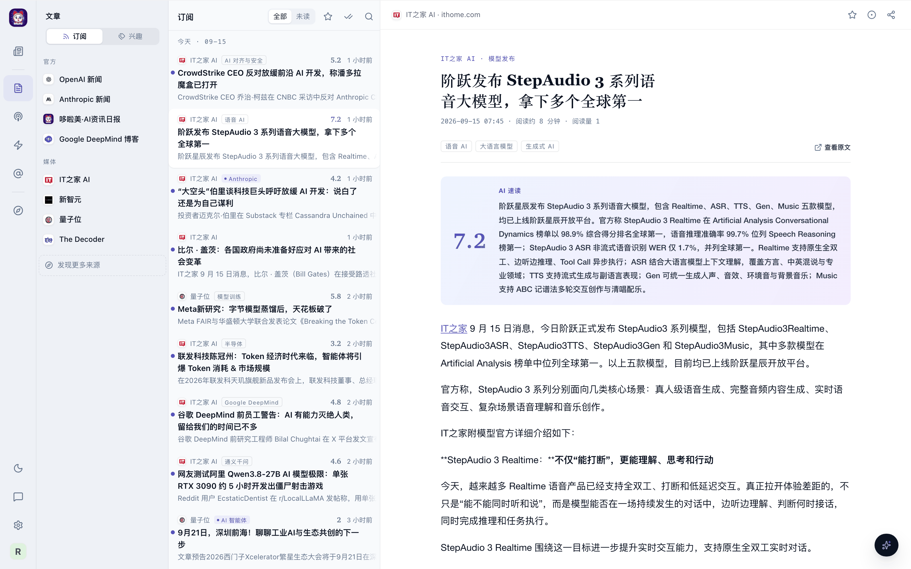
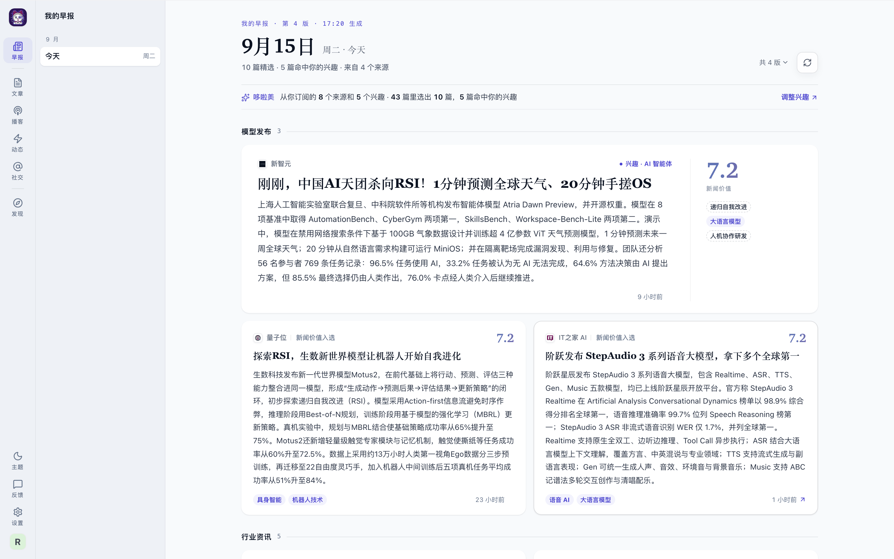
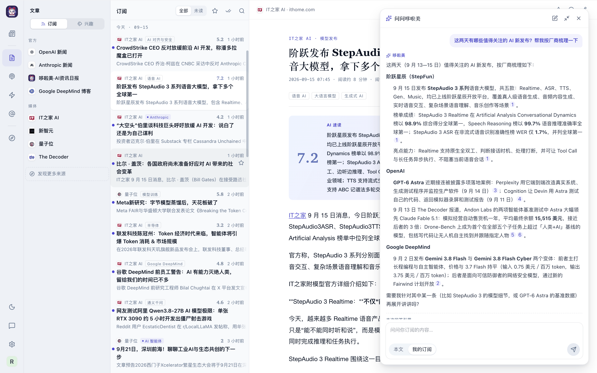
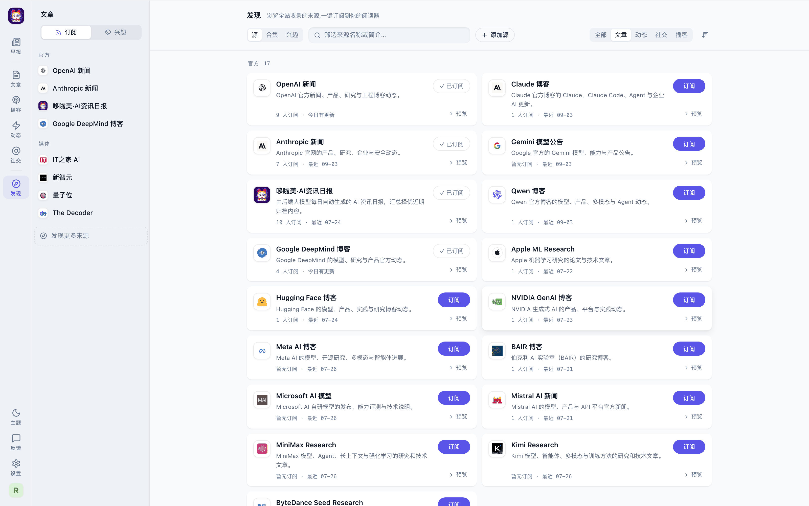
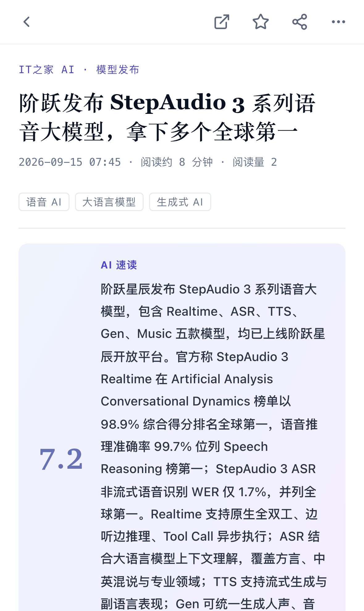

# 哆啦美 · DoramiSourceArchive

**一个自托管的 AI 资讯阅读器**：把散落在官方博客、科技媒体、个人博客、X 时间线、播客里的 AI 动态收进同一个归档，交给大模型打分、摘要、打标，再按你的订阅和兴趣编成每天一份的个人早报。你只需要打开它，读今天值得读的东西。



## 它能做什么

### 每天一份属于你的早报

每天早上 8:30，哆啦美从你订阅的来源和关注的兴趣里选出当天最值得读的十来篇，按「重大事件 / 模型发布 / 行业资讯 / 开源动态……」分板块排成一版报纸。每张卡片带一个**新闻价值分**和一句「为什么重要」；分数越高的卡片占的版面越大。全站范围内的头条大事会作为「重大事件」置顶，哪怕它不在你的订阅里。



### 一个安静的阅读器

- **订阅制**。左栏是你的订阅源，按官方 / 媒体 / 个人 / 榜单分组；文章、动态（changelog、发布说明）、社交（X 推文）、播客各是一个容器，形态不同就不混在一起。
- **兴趣是一面透镜**。左栏可以切到「兴趣」轴，按你关注的主题、行业、公司横切全站内容，不受订阅范围限制。
- **未读、收藏、标读、右键菜单、站内深链与公开分享链接**。桌面端的每一个动作在手机上都有对应的长按动作单。
- **每篇文章都带 AI 速读**：新闻价值分、一段摘要、一句评分依据，点击分数可以在两层之间切换。

### 问哆啦美

阅读窗右下角的星标打开问答面板。可以只问当前这篇，也可以问「我的订阅」——哆啦美会先规划检索、在全文索引里找出相关文章，再给出带编号引用的回答，每个引用都能一键跳转到原文。文章页还提供一键中文翻译，标题与正文一起译。



### 发现来源

发现页是全站来源目录：按角色分组、显示订阅人数与最近更新，一键订阅或先预览。策展合集（前沿实验室官方、国产开源模型动态、AI 编程工具……）可以整组订阅；也可以贴一个 RSS 地址添加只有自己可见的私有来源。



### 手机上直接打开

同一个地址在手机浏览器或微信里打开就是移动版阅读器：底部四个 Tab、全屏正文页、长按动作单、返回键与页面栈握手。不需要装 App。

<p align="center">
  
</p>

## 内容从哪里来

- **60 多个内置来源**：OpenAI、Anthropic、Google DeepMind、Qwen、Mistral 等官方博客，Claude Code、Codex、Cursor、DeepSeek API 等工具与平台的更新日志，量子位、IT之家、新智元、The Decoder 等媒体，Simon Willison、Import AI 与 HN 人气博客榜上的个人博客，Hugging Face Daily Papers、GitHub Trending、Arena 排行榜等榜单，以及 OpenAI、DeepSeek、Karpathy 等 X 账号的时间线；另有 36 个精选播客节目。每个来源都经过采集器适配与正文质检，抓下来的是干净的 Markdown 正文。
- **入库即分析**：每篇文章落盘后由后台 worker 用大模型打新闻价值分、写摘要、按受治理的标签目录（主题 / 行业 / 实体）打标。文章配图可以交给视觉模型识别成文字说明，一并喂给摘要与问答。
- **公共 AI 日报**：管理员可以按 cron 生成全站视角的每日资讯日报，同一把评分尺子，去重后确定性排版。
- **对外交付**：每个读者都有一个聚合 Feed 令牌，可以用 JSON 或 Markdown 拉取自己订阅范围内的内容；同一范围也通过 MCP 暴露给 Claude、IM 机器人等 Agent，并提供可下载的 Claude 技能包。

## 管理面

管理员登录后是一个独立的管理台：节点管理（采集器目录、参数、运行、隐藏）、采集任务与运行历史、知识台账（全库文章的检索与编辑）、AI 日报、运维看板（AI 用量、读者活跃、内容热度、媒体缓存、操作审计）、账户与公告。管理员同时也是读者，一键切换到阅读器。支持任意数量的管理员，管理写操作全部入审计。

## 本地启动

后端 Python 3.12 + FastAPI，依赖用 [uv](https://docs.astral.sh/uv/) 管理；前端 React + Vite；数据落在 `data/` 目录的 SQLite 里，零外部服务。

```bash
# 后端:http://127.0.0.1:8088,热重载;API 文档在 /docs
uv sync
python src/main.py

# 前端:http://127.0.0.1:5173,/api 代理到后端
cd frontend && npm install && npm run dev
```

首次启动会自动创建根管理员 `admin` / `admin`，登录后请立即改密。大模型走任意 OpenAI 兼容端点（DeepSeek、Kimi、智谱、通义、OpenRouter、Ollama、vLLM 均可），在「设置 → 凭据」里填 `base_url` / `api_key` / `model` 即可启用评分、早报、翻译与问答；不配置时采集与阅读照常工作。

```bash
# 测试
.venv/bin/python -m pytest tests/

# 生产部署:Docker(推荐)或裸机 PM2,均按发布 tag 部署
./deploy-docker.sh          # 详见 docs/deploy-docker.md
./deploy.sh                 # 详见 docs/deploy-baremetal.md
```

## 给开发者与 Agent

架构简报、开发命令与全部工程约定在 [`CLAUDE.md`](./CLAUDE.md)；通用 Agent 入口是 [`AGENTS.md`](./AGENTS.md)；文档总索引在 [`docs/README.md`](./docs/README.md)。
