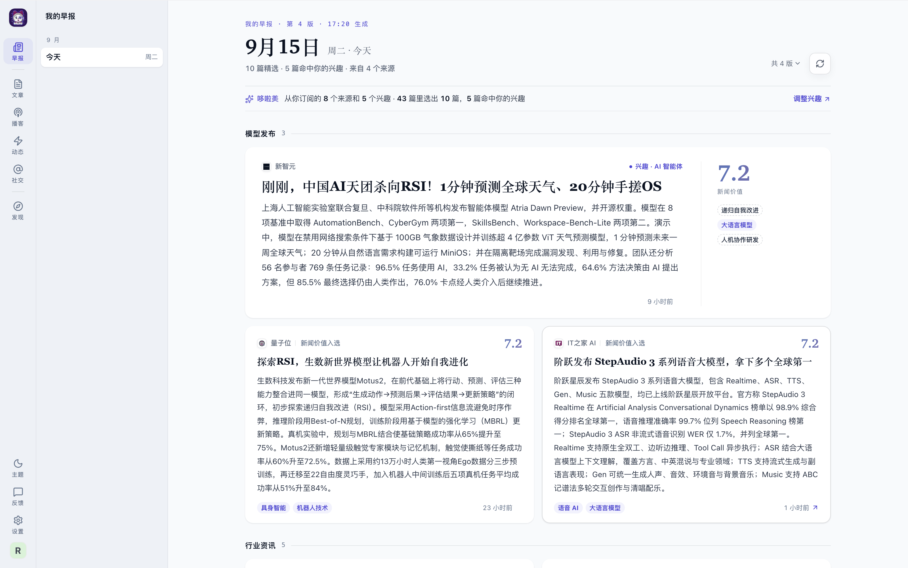

# 读每天的早报

每天早上，哆啦美从你订阅的来源和你关注的兴趣里挑出当天最值得读的十来篇，排成一版早报。读完这一版，就知道今天 AI 领域发生了什么。

## 打开早报

登录后第一屏就是早报。在别的页面时，点左侧竖栏最上面的「早报」回来；手机上点底部最左边的「早报」。

早报每天早上编排。如果打开时页面显示「早报编排中…」，稍等片刻即可。

## 看懂整版早报

从上到下依次是：

- **报头**：日期和「第几版 · 几点生成」，下面一行写这一版有几篇、来自几个来源，有文章命中你的兴趣时也写出篇数。
- **编排说明**：以「哆啦美」开头的一行，说明这一版是从多少个来源、多少篇文章里选出来的；有文章命中你的兴趣时，也写出篇数。右端的「调整兴趣」直接跳到兴趣设置（还没设置兴趣时叫「设置兴趣」）。
- **板块**：按「重大事件」「模型发布」「行业资讯」「开源动态」「学术论文」「工程实践」「观点洞察」等顺序排列，没有内容的板块不出现。板块内按新闻价值分从高到低排。

### 看懂一张卡片

每张卡片包含：

- **来源**：左上角的来源名和图标。
- **入选理由**：来源名右侧的短语，说明它为什么在这里，见下一节。
- **标题**：外文标题通常配有中文译名，原标题以小字列在下方。
- **摘要**：AI 写的一段内容概要。
- **新闻价值分**：右上角的数字，衡量这件事有多重要。这是 AI 的评估，用来帮你筛选，不代表事实保证，也不是你的个人评分。
- **标签**：底部的主题标签，说明它讲的是什么。

正式早报的第一张是通栏头条；其余卡片中，分数高的通常更宽。手机上卡片一律单列。

### 分数与入选理由一起看

新闻价值分满分 10，用于比较内容的重要程度；兴趣标记说明它与你关注的方向有关，两者不是同一个含义。高分不等于你一定感兴趣，命中兴趣也不代表最高分。先扫入选理由和摘要，再打开你想深入看的文章；要查看评分依据，打开文章后点 AI 速读卡片里的分数。

标签说明内容谈到的主题，不表示你已经关注了这个方向。要让后续早报优先考虑它，在「调整兴趣」里选择对应兴趣。

## 为什么选这一篇 {#why}

卡片上的入选理由有四种：

- **兴趣 · 某个标签**：命中了你关注的兴趣，例如「兴趣 · AI 智能体」。
- **重大事件**：全站范围内的重大事件，置顶在「重大事件」板块。后面跟「官方一手」表示消息来自官方，跟「N 家来源」表示有几家来源同时报道。
- **新闻价值入选**：来自你订阅的来源，新闻价值分足够高。
- **最新更新**：当天没有够分量的文章，这里列的是你订阅来源的最新内容，见[常见问题](#degraded)。

重大事件和兴趣命中的文章可能来自你没订阅的来源。这类卡片的来源名后面有一个浅色的「未订阅」，鼠标移上去变成「+ 订阅」，点一下就能订阅这个来源。

## 打开文章

点卡片任意位置，就在阅读器里打开这篇文章（X 推文卡片会直接打开 X 上的原帖）。正文上方多出一条横栏：

- 「返回我的早报」：回到早报，停在刚才的位置，刚读过的那张卡片会短暂高亮。
- 「早报下一条」：不回早报，直接读这一版的下一篇，右侧显示读到了第几篇。

## 看往期和同一天的其他版本

- **往期**：桌面上，早报页左栏按月份列出每一天，点一天就看那天的早报。手机上，日期排在页面顶部，左右滑动选择。
- **同一天的多个版本**：一天里重新编排过，报头右侧会出现「共 N 版」，点开可以切换查看每一版。

## 让早报更合你的口味

- **订阅**：早报的主要内容来自你订阅的来源。在「发现」页增减来源，见[快速开始](/guide/quick-start#subscribe)。
- **兴趣**：点编排说明右端的「调整兴趣」（还没设置兴趣时叫「设置兴趣」）增减标签。兴趣命中的文章会优先入选。
- **立即重编**：改了兴趣或订阅后，今天这一版不会自动变，编排说明里会提示「你的兴趣已更新，下次编排生效」（改订阅时写「你的订阅」）。想马上看到效果，点后面的「立即重编」。
- **重新编排**：报头右侧的刷新按钮随时可以把今天的早报重编一次。

## 常见问题

### 早报上写着「降级生成」是什么意思？ {#degraded}

当天你的订阅范围里没有达到入选标准的文章时，早报不会空着，而是列出你订阅来源的最新更新，报头标「降级生成」。这些内容不计入正式精选。多订阅几个来源、设置兴趣，通常就能看到正式的早报。

### 提示「部分来源更新尚未完成」或「部分文章分析尚未完成」怎么办？

这表示这一版编好时，还有部分内容没有准备好。稍后点提示后面的「重新编排」，就能把新内容补进来。

### 早报是空的，怎么办？

如果页面显示「还没有订阅来源，也没有设置兴趣」，点「订阅来源」或「设置兴趣」开始。如果显示「你的订阅源今天还没有可展示的更新」，可以点「管理订阅」多订几个来源，或者点「先去看文章」浏览已有内容。

### 为什么早报里有我没订阅的来源？

两种情况：它是全站范围的重大事件，或者命中了你的兴趣。这类卡片会标「未订阅」，可以顺手订阅，也可以不管。

### 新闻价值分是怎么来的？

它是 AI 对「这件事有多重要」的评估，用来帮你快速筛选，不代表事实保证，也不代表你个人的喜好。

### 今天的早报没有完成？

页面显示「今日早报没有完成」时，点「重试生成」再编一次。等待期间可以点「先去看文章」在阅读器里浏览。
