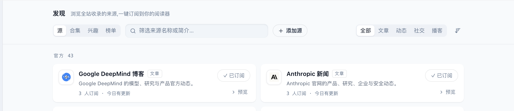
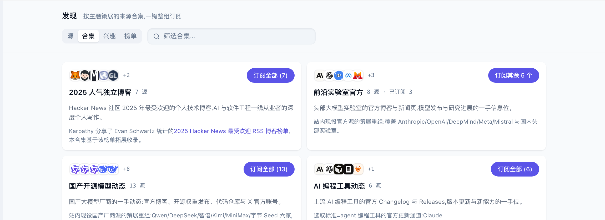
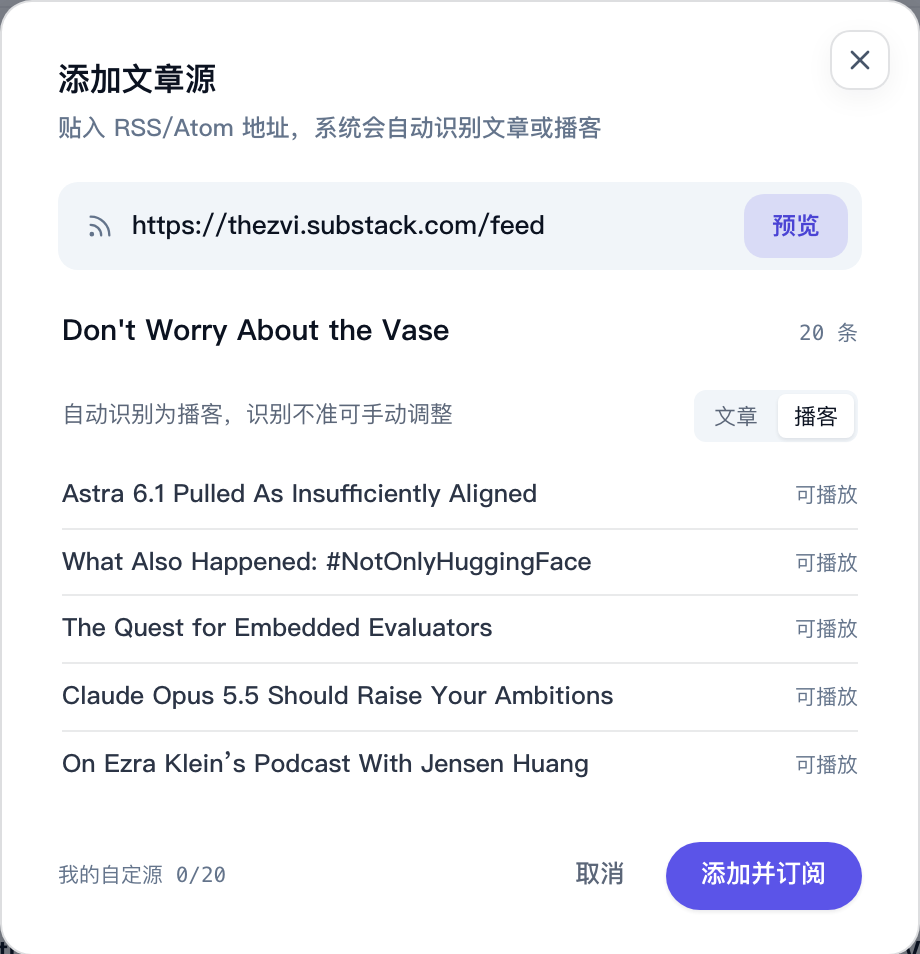

# 找到更多来源

「发现」页列出这个站点收录的全部来源。在这里可以先预览再订阅，也可以按主题合集整组订阅，站点开放了「添加源」时，还能添加一个只有你能看到的 RSS 源。

点左侧竖栏的「发现」（指南针图标）进入。顶部有四个页签：「源」「合集」「兴趣」「榜单」。

## 浏览和订阅来源

在「源」页签：

- 来源按「官方」「媒体」「个人」等分组，每张卡片写着名称、简介、订阅人数和最近一次更新。
- 右侧的「全部 / 文章 / 动态 / 社交 / 播客」按形态筛选，搜索框按名称或简介筛选，最右边的按钮切换按订阅人数排序。
- 点卡片上的「订阅」就订阅了，按钮变成「✓ 已订阅」；鼠标停在上面时显示「取消订阅」，再点一次取消。

筛选「文章」或「播客」时，会出现「订阅全部文章源（剩余 N 个）」这样的按钮，一次订阅这一类里你还没订的全部来源。

## 预览后再订阅

拿不准要不要订，点卡片上的「预览」。阅读器会打开这个来源最近的内容，来源栏顶部标着「预览」，列表上方有一条「订阅「来源名」」，看完觉得不错点它就订阅了。

## 按合集整组订阅

「合集」页签里是按主题整理好的来源组合，例如某个方向的官方博客、某类工具的更新日志。

- 点「订阅全部 (N)」订阅合集里的全部来源；已经订了一部分时，按钮写「订阅其余 N 个」。
- 点卡片本身可以看合集里有哪些来源，逐个订阅。
- 全部订阅后按钮变成「✓ 已全部订阅」。想整组退订，鼠标移上去点「退订合集」，按钮会问「确认退订 N 个源?」，几秒内再点一次才会退订。

## 添加自己的 RSS 源

站点没收录你想看的网站，而它提供 RSS 或 Atom 订阅地址时，可以自己加。「源」页签上没有「添加源」按钮，说明当前站点没有开放这项功能。

1. 在「源」页签点「添加源」。
2. 贴入订阅地址，点「预览」。
3. 预览会显示来源名称、条目数和几条样例，并自动识别是文章还是播客；识别不对可以手动切换「文章 | 播客」。名称也可以改。
4. 点「添加并订阅」。

自己添加的来源只有你能看到，在来源栏的「自定源」分组里。窗口左下角显示你已经添加了几个、最多能加几个。如果这个地址站点已经收录了，窗口会直接告诉你，点「订阅该源」即可。

不想要了，在来源栏里右键它选「移除自定源」。

## 看榜单

「榜单」页签（也可以点阅读器来源栏顶部的「文章榜」「播客榜」）展示全站近 7 天收录内容的标签趋势，不代表全网热度：

- 左边按「话题」「产业」「实体」排出出现次数最多的标签，右上角切换「文章榜」「播客榜」。
- 点一个标签，右边列出这个标签下分数最高的内容和它 30 天的趋势。趋势按每天的快照积累；还没有足够快照时，会提示稍后再看。
- 下方的「全局高分榜」是全部历史公开内容的前 10 名，不限近 7 天；「必读文章」（播客榜里叫「必听播客」）则帮你找在多个标签榜里都值得关注的内容。播客条目旁还会注明「简介初评」或「全文终评」，比较分数时一起看。

榜单统计的是全站内容，和你订阅了什么无关。

### 榜单数字和标记怎么读

标签后的次数表示它在统计范围内出现的频次，不是新闻价值分，也不是你的阅读次数。「新」表示本期新上榜，「↑ N / ↓ N」表示相对上期的排名变化，「持平」表示排名不变。标签频次适合看大家最近集中在谈什么，高分内容适合挑值得读或听的条目。

点具体文章或播客可以打开阅读器；先看摘要与评分依据，再决定要不要深入。榜单没有内容时，可以切换文章榜与播客榜，或先到「源」里预览内容。

## 常见问题

### 我订阅的来源为什么在发现页找不到了？

它可能暂时下架了。已订阅的人仍能在来源栏里看到它，带「暂不可用」标记。

### 添加 RSS 源时预览失败？

先确认贴入的是网站上明确标为 RSS 或 Atom 的订阅地址，而不是网站首页。换一个地址后再点「预览」。

### 自己添加的来源别人能看到吗？

看不到。它只出现在你自己的阅读器里。
