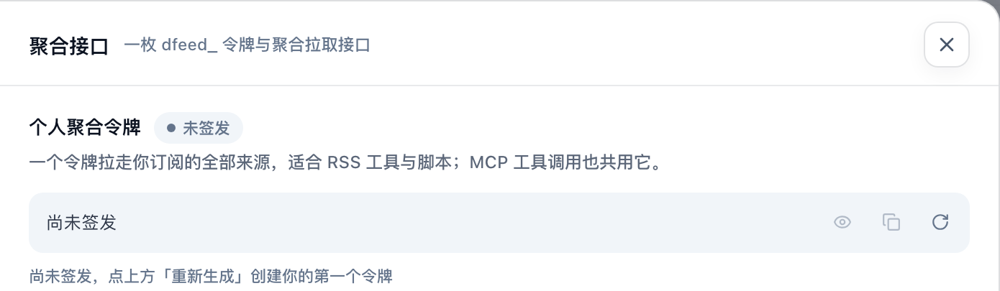

# 把订阅接到别的工具

除了在哆啦美里读，你还可以把自己订阅的内容接到别的地方：RSS 工具、自己写的脚本，或者 Claude Code、Cursor 这类 AI 助手。

所有入口都在「设置 → 接入集成」里：点左侧竖栏底部的「设置」（手机上在「我的」页点「设置」），「接入集成」下有三项：

| 入口 | 适合做什么 |
|---|---|
| 聚合接口 | 用一个令牌拉取你订阅的全部内容，给 RSS 工具或脚本用 |
| MCP 接入 | 让 AI 助手直接检索和浏览你订阅的内容 |
| Agent 技能包 | 装一个现成的技能，对 AI 助手说「看看今天的 AI 日报」 |

无论哪种方式，读到的文章都只来自你已订阅的来源（MCP 可以另外列出站点的来源目录）。订阅变了，接出去的内容也跟着变。

## 聚合接口：给 RSS 工具和脚本用

「聚合接口」页的核心是你的**个人聚合令牌**，一个令牌就能拉取你订阅的全部来源。

1. 第一次使用时，点令牌框右侧的「重新生成」签发令牌。
2. 完整令牌只在生成的这一刻显示，马上点「复制令牌」保存好。
3. 页面下方列出了拉取地址和一条可以直接复制的示例命令，把示例里的令牌占位换成你的令牌即可。展开「接口参数」可以看到按发布日期、内容类型、来源、关键词筛选的写法。

令牌相当于你的订阅的钥匙，不要发给别人。怀疑泄露了，就点「重新生成」：旧令牌立即失效，用到它的地方都要换成新令牌。

## MCP 接入：给 AI 助手用

MCP 是 AI 助手连接外部工具的通用方式。接好后，你可以在 AI 助手里直接问「我订阅的来源最近在说什么」，它会自己去检索你的订阅内容。

1. 先在「聚合接口」页拿到你的令牌。
2. 打开「MCP 接入」，在右上角选你用的工具对应的格式：「Claude Code」「OpenCode」「Codex」或「URL」。页面下方写着每种格式适用哪些工具，例如 Claude Code 格式也适用于 Claude Desktop、Cursor、Windsurf、Cline。
3. 复制页面上的配置，把其中的「dfeed_你的令牌」换成你的令牌，粘贴到 AI 助手的配置里。不同工具的配置位置不同，以工具自己的文档为准。

页面下方「可用工具」列出了 AI 助手能用的几种操作，例如按关键词全文搜索、按来源和日期浏览、读取单篇全文。

如果页面顶部显示「已停止」，说明当前站点暂时没有提供这项服务。

## Agent 技能包：一句话看日报

如果你的 AI 助手支持 Agent Skills（例如 Claude Code、Codex、OpenCode），可以装一个现成的每日资讯技能：

1. 点「下载技能包」，得到 `dorami-daily-brief.zip`。
2. 解压到工具的 skills 目录，例如 Claude Code 是 `~/.claude/skills/`。
3. 对 AI 助手说「看看今天的 AI 日报」。

技能包已经按你所用站点的地址配置好。它要用你的聚合令牌读取订阅内容，AI 助手向你要令牌时，把「聚合接口」页的令牌给它即可。

## 选内容格式与筛选

「聚合接口」页提供普通文章数据与 Markdown 两种拉取地址：想在文字工具里继续读，可选 Markdown；要做筛选或整理，可按页面的示例选用数据格式。展开「接口参数」看可用的来源、内容类型、关键词和日期筛选，不需要记住所有参数。

生成令牌不会自动替你订阅来源。先在[发现](/features/discover)订阅，再到外部工具读取；更换令牌时，要同步更新所有使用它的工具。

## 常见问题

### 我把令牌弄丢了，能再看一次吗？

不能，完整令牌只在生成时显示一次。点「重新生成」拿一个新的，再把用到旧令牌的地方都换掉。

### 接出去的内容为什么比站点上少？

聚合接口和 MCP 只返回你已订阅来源的文章。想多拿一些，先在「发现」页多订阅几个来源。

### 重新生成令牌后，AI 助手连不上了？

旧令牌已经失效。把 AI 助手配置里的令牌换成新的即可。
