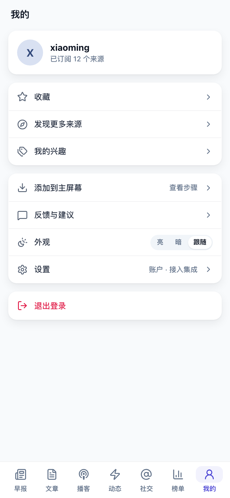
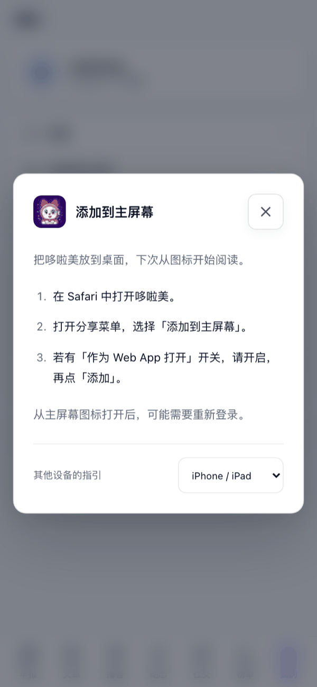

# 在手机上用

哆啦美不用装 App：用手机浏览器打开同一个网址，登录后就是手机版。你的订阅、未读、收藏和兴趣和电脑上是同一份。

  
  

## 底部页签

底部从左到右是「早报」「文章」「播客」「动态」「社交」「榜单」「我的」：

- **早报**：你的每日早报，页面顶部的日期条可以切到往期，见[读每天的早报](/features/brief)。
- **文章、播客、动态、社交**：和电脑上的阅读器一样。左上角的按钮打开订阅源列表，可以只看某个来源，也可以切到「兴趣」按标签浏览。顶部有「全部 / 未读」、只看收藏、全部标为已读和搜索。
- **榜单**：全站近 7 天的热门话题，见[找到更多来源](/features/discover#看榜单)。
- **我的**：收藏、「发现更多来源」、「我的兴趣」、添加到主屏幕、反馈与建议、外观和设置。

## 读一篇文章

点列表里的一条，全屏打开正文。顶部的按钮从左到右是：返回列表、查看来源、收藏、分享、「译」（外文文章才有，把正文译成中文）和「更多操作」。

正文里同样有 AI 速读、标签、阅读量，底部是「上一篇」「下一篇」。

## 长按

在列表里长按一条内容，从底部弹出操作菜单，和电脑上的右键菜单一样：标为已读或未读、收藏、复制站内链接、打开原文、标记该源全部已读。手机浏览器支持系统分享时，还会多一项「分享给…」，可以直接发到微信等应用。

在订阅源列表里长按一个来源，可以「全部标为已读」「打开原站」或「退订此源」。

## 添加到主屏幕

添加后，手机桌面上会有一个哆啦美图标，点开就是全屏的哆啦美，和 App 一样。

1. 点底部的「我的」，再点「添加到主屏幕」。
2. 浏览器能直接安装时，会弹出它自己的安装提示，确认即可。否则会弹出操作步骤，按提示操作：
   - **iPhone / iPad**：在 Safari 中打开哆啦美，打开分享菜单，选择「添加到主屏幕」；如果有「作为 Web App 打开」开关，请开启，再点「添加」。
   - **Chrome / Edge**：打开浏览器菜单，选择「安装应用」或「添加到主屏幕」，按提示确认。
   - **其他浏览器**：在浏览器菜单里找「安装应用」「添加至桌面」或「添加到主屏幕」。

电脑上也可以这样安装：点左侧竖栏的「设置」，在「外观」里找到「添加到主屏幕」。

## 在微信里打开

微信里可以直接阅读。想添加到主屏幕，要先点右上角菜单，选择在系统浏览器中打开，再按上面的步骤添加。

## 常见问题

### 从主屏幕图标打开后要我重新登录？

第一次从图标打开时，可能需要再登录一次，之后和在浏览器里一样保持登录。

### 我的菜单里没有「添加到主屏幕」？

已经从主屏幕图标打开时，这一项不会出现；个别浏览器（例如鸿蒙系统自带的浏览器）也不显示这一项。可以把网址加入浏览器收藏继续使用。

### 页面顶部提示「新版本已就绪」？

哆啦美更新了，点「刷新」就能用上新版本。

### 提示「网络已断开，联网后可继续阅读」？

手机暂时没网。联网后可以继续使用；如果内容没有更新，刷新一下页面。
