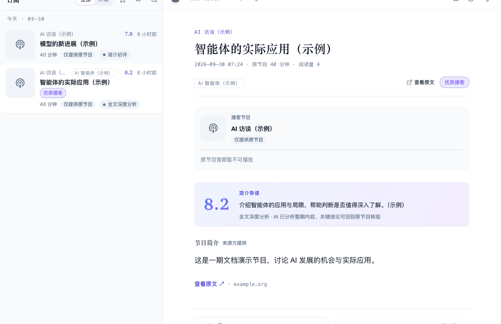

# 听播客

哆啦美收录了一批 AI 相关的中英文播客。订阅后，新的一期会出现在「播客」里，点开就能收听，还能看节目简介和逐字稿。部分节目会有 AI 整理的中文「精品导读」，几分钟听完一期长访谈的要点。

## 订阅播客

在「发现」页的「源」页签把筛选切到「播客」，在想听的节目卡片上点「订阅」。想一次订阅全部播客，点「订阅全部播客源（剩余 N 个）」。详见[找到更多来源](/features/discover)。

## 收听一期节目

1. 点左侧竖栏的「播客」。列表里每一期显示节目名、标题、时长和封面。
2. 点一期，右侧打开单集页。
3. 在播放器里点播放。播放、暂停、拖动进度和调整速度都用播放器自带的按钮。

听到一半离开也没关系：下次打开同一期，会从上次的位置接着播。

单集页上还有：

- **节目简介**：播客方提供的节目说明，标注「来源方提供」。
- **逐字稿**：有逐字稿的节目会在下方列出，可以折叠；较长的逐字稿点「继续阅读逐字稿」往下加载。
- **查看原文**：打开这期节目在播客平台上的页面。

## 分数、评分依据与「优质播客」

列表里节目名旁的数字，以及单集页 AI 导读卡片左侧的大数字，都是新闻价值分，满分 10。它帮助你判断这期内容是否值得花时间了解，不是听众打星、播放热度或你个人的喜好；你不能在这里给节目打分。点导读卡片的分数，可以翻到评分理由；播客这一面以「简介初评」或「全文深度分析」为标题，再点一次回到要点。

图中节目、分数和内容均为示例。

### 先看评分针对什么

- **简介初评**：依据节目简介的初步判断，还没分析完整节目。即使分数很高，也不表示已经有全文导读。
- **全文深度分析**：已经分析整期内容，分数和要点更适合判断要不要深入听。重要结论仍请回到原节目核实。

完整内容与简介提供的信息不同，全文分析后的分数可能变化。看分数时一起看旁边的评估标记，不要把简介初评当成整期节目的最终评价。

### 「优质播客」和能否听导读是两回事

列表标题旁和单集页里出现「优质播客」，表示这期节目的全文评估达到了站点的优质标准；只有简介初评的高分不会得到这个标记。具体分数线以你所用站点为准。

这个标记帮你选节目，不表示导读音频已经生成。想听导读，仍要看「精品导读音频已就绪」或播放器的「精品导读」选项；只有中文导读文字时，可以先读文字。

点播同样要等全文评估完成并达到点播要求。简介初评很高但尚未完成全文评估，仍可能提示稍后再试；未达到要求时可以继续听原节目。是否开放点播和当天剩余次数，也会影响能否提交。

## 逐字稿与语言

有逐字稿时，点标题行可展开或收起。提供多个版本时，可在「逐字稿来源」里切换查看；来源说明帮助区分发布方提供的文字与 AI 转写。较长的文字点「继续阅读逐字稿」加载后续，导读文章也可能需要点继续阅读。

外文节目出现「原语言 / 译为中文」时，可以翻译节目简介和逐字稿。逐字稿显示「正在翻译逐字稿」时等待完成；失败后点「重新翻译」。切回「原语言」仍可读原文。翻译的可用条件与[文章翻译](/features/ask-and-translate#把文章翻译成中文)相同。

## 精品导读

精品导读是 AI 根据整期节目整理的中文版本，通常有一段可以收听的音频和一篇可以阅读的中文文章，适合先快速了解一期长节目讲了什么，再决定要不要听完整版。

- 列表里的标签告诉你这一期有什么：「精品导读音频已就绪」表示可以直接听导读；「中文导读已生成」表示有中文导读文章；「仅提供原节目」表示只有原版。
- 有导读音频的节目，播放器上方可以在「原节目」和「精品导读」之间切换，各自记住播放位置。
- 导读文章显示在单集页里，标题是「精品导读」或「中文导读」。
- 「优质播客」表示全文评估达标；能否收听仍以音频就绪标记为准。

### 自己点播精品导读

有些节目还没有导读音频，如果站点开放了点播，播放器上会出现点播按钮：还没有导读时叫「点播精品导读」，已有中文导读文章时叫「生成导读音频」。点一下提交，按钮先显示「提交中…」，开始生成后显示「生成中…」，生成好后就能听。

点播每天有次数限制，和文章的「听导读」共用。点的是已经生成好或正在生成的导读时，不占用次数。

### 看懂生成状态

「导读文字已生成，音频生成中…」表示文字已经可读，音频还要等；「导读文字已生成，音频失败」表示可以读文字，暂时不能听。不要把「已生成文字」当成播放器已就绪，等待音频完成后再切到「精品导读」。

## 听文章的导读

部分文章的 AI 速读卡片上有「听导读」按钮，点一下会生成一段中文音频，概括这篇文章的内容。生成好后就能在文章页里收听。它和播客点播共用每天的次数。

## 常见问题

### 点播时提示「评分过低，不值得点播哟～」？

这一期节目的新闻价值分不够高，暂不提供导读，可以直接听原节目。

### 提示「全文终评还在进行中，稍后再试～」？

这一期还在处理中，过一会儿再点。

### 为什么我看不到「点播精品导读」按钮？

当前站点没有开放点播，或者这一期已经有导读了。

### 原节目播放不了？

播放器会提示「原节目音频加载失败，请打开节目页面收听或稍后重试」，点「打开节目页面 ↗」到播客平台上收听。
