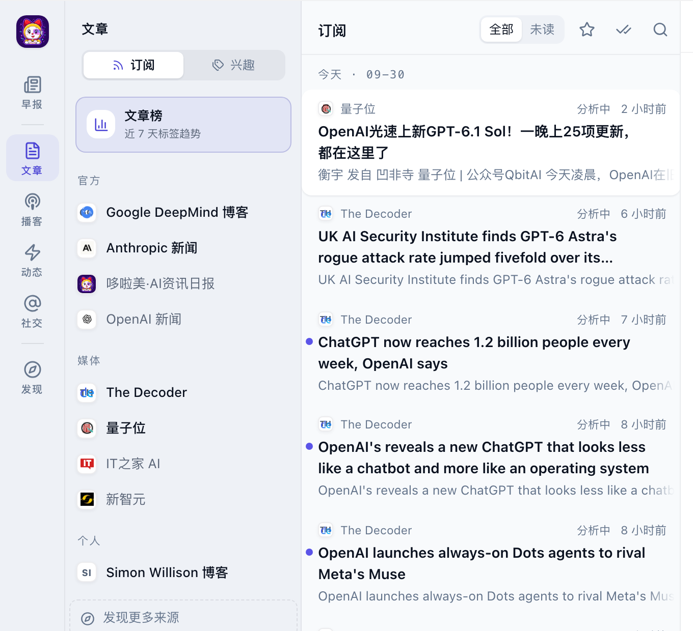
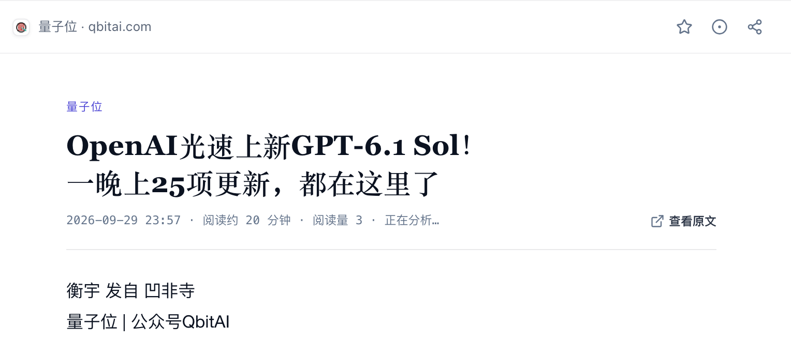
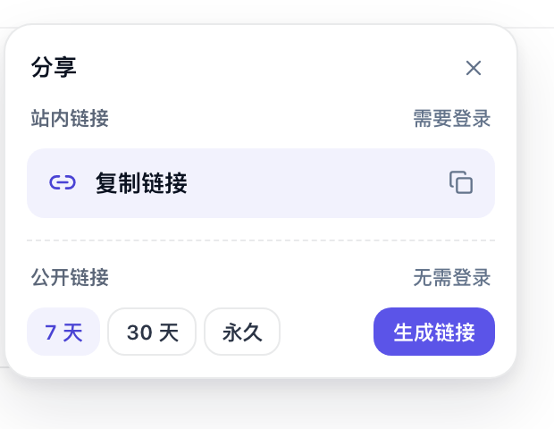
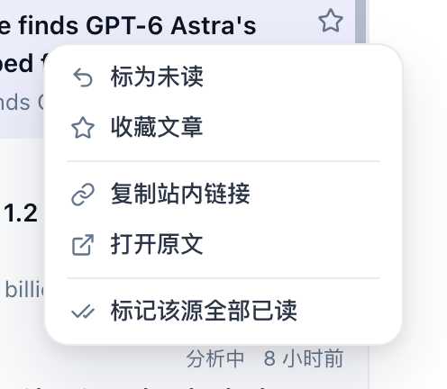

# 读文章与订阅内容

早报之外的所有内容都在阅读器里：你订阅的来源发了什么，按时间排好，未读的有标记，读到好的可以收藏、分享。

## 认识阅读器

桌面上从左到右是四栏：

1. **左侧竖栏**：最左边一列。上面是「早报」「文章」「播客」「动态」「社交」「发现」，下面是「主题」「反馈」「设置」和你的头像。
2. **来源栏**：列出你订阅的来源，按「官方」「媒体」「个人」等分组。
3. **文章列表**：当前范围里的内容，按日期分组，最新的在上面。
4. **阅读窗**：点列表里的一篇，正文在这里打开。

## 切换内容

点左侧竖栏上的入口切换：[播客](/features/podcasts)、[动态](/features/updates)、[社交](/features/social)各有自己的页面。点来源栏里的某个来源，只看这个来源的内容。

## 按订阅或按兴趣浏览

来源栏顶部有「订阅 | 兴趣」两个选项（社交页没有）：

- **订阅**：列出你订阅的来源，列表里是这些来源的内容。
- **兴趣**：列出你关注的兴趣标签，列表里是全站命中这些兴趣的内容，也包括你没订阅的来源。选一个标签就只看这个方向。

按兴趣浏览时，来自未订阅来源的条目会带一个浅色的「未订阅」，鼠标移上去变成「+ 订阅」，点一下就能订阅。怎么设置兴趣见[管理兴趣](/features/interests)。

## 未读、标读与收藏

- **未读**：标题左侧有蓝色小圆点的就是没读过的。列表顶部的「全部 | 未读」可以只看未读。
- **标读**：打开一篇就算读过。列表顶部的双对勾按钮把当前范围全部标为已读，点了直接生效，没有确认；按兴趣浏览且未读很多时，可能提示「已标记一批,仍有未读,请再点一次」，再点一次即可。阅读窗右上角的按钮可以把单篇标为已读或未读。
- **收藏**：鼠标移到列表里的条目上，右侧会浮出星标，点亮就收藏了；阅读窗右上角也有星标。列表顶部的星标按钮切换「只看收藏」。

## 搜索

点列表顶部的放大镜，输入关键词，搜索当前范围里的标题和正文，命中的文字会高亮。点 ✕ 关闭搜索并清空关键词。

## 阅读一篇文章

- 标题下面一行依次是发布时间、「阅读约 N 分钟」和「阅读量 N」（全站累计打开次数）。
- 「查看原文」在新标签页打开原网页；正文末尾也有一个「查看原文 ↗」。
- 标题下的小标签可以点，点了按这个词搜索。
- 大多数文章正文上方有一张 **AI 速读** 卡片：左边是新闻价值分，右边是几句话的要点。点分数可以看评分依据，见[问哆啦美与翻译](/features/ask-and-translate#ai-card)。
- 外文文章的标签行旁边有「原语言 | 译为中文」，可以把全文译成中文。
- 正文底部是「← 上一篇」「下一篇 →」，按列表顺序接着读。

## 分享给别人

点阅读窗右上角的分享按钮，有两种链接：

- **站内链接**（需要登录）：点「复制链接」。对方用自己的哆啦美账号登录后，直接打开这一篇。
- **公开链接**（无需登录）：选有效期「7 天」「30 天」或「永久」，点「生成链接」，链接会自动复制。对方不用账号就能看这一篇的标题和正文，看不到你的订阅和其他内容。

生成公开链接后，浮层里会显示它还有多久过期、被打开过几次。点撤销按钮，链接立即失效；点「换新链接」会生成一条新的，旧的同时失效。一篇文章同一时间只有一条有效的公开链接。

## 右键菜单

在文章列表的条目上点右键：

- 「标为已读 / 标为未读」「收藏文章」
- 「复制站内链接」「打开原文」
- 「标记该源全部已读」

在来源栏的来源上点右键，有「全部标为已读」「打开原站」「退订此源」。

## 取消订阅

- 鼠标移到来源栏的某个来源上，右侧会出现减号，点一下就退订，不会弹确认。
- 也可以右键这个来源选「退订此源」，或者在「发现」页把「✓ 已订阅」按钮点掉。

退订后，这个来源从来源栏里消失，早报也不再从它选稿（重大事件和命中你兴趣的内容除外）。想再看，去「发现」页重新订阅。

## 常见问题

### 来源名后面写着「暂不可用」？

这个来源暂时下架了，点进去会显示「该来源暂时不可用」。你的订阅还在，恢复后内容会回来；也可以直接退订。

### 列表里显示「分析中」？

这篇文章的新闻价值分和 AI 速读还没出来，稍后再看。正文不受影响，可以直接读。

### 读到一半想换设备？

未读、已读和收藏记在你的账号上，换一台电脑或用手机登录同一个账号，状态是一样的。
