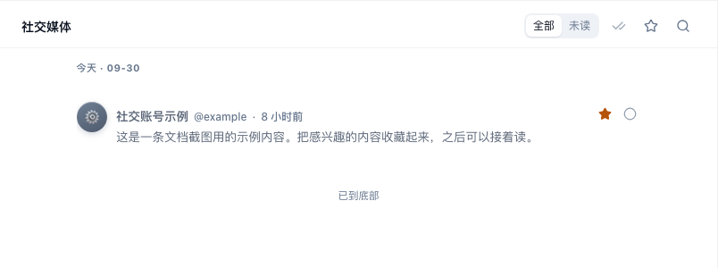

# 看社交帖子

「社交」把你订阅的 X 等社交账号的帖子放在一处，以卡片流展示。正文直接在卡片里读，不用逐条打开阅读窗。

## 怎么用

### 浏览账号的帖子

点左侧竖栏的「社交」，再点来源栏里的账号，只看这个账号的帖子。想增加账号，去[发现](/features/discover)预览并订阅。

### 收藏和标读

卡片右上角的星标用于「收藏」，旁边的对勾用于「标为已读」；已经读过的帖子可以再「标为未读」。浏览卡片后，想记下读到哪一条，就点标读按钮。

### 到原平台继续看

点帖子顶部的时间，在新标签页打开原帖。想参与讨论或查看原帖后续，可以到原平台继续。

### 卡片上的信息与筛选

卡片顶部显示账号名、账号标识和发布时间；有图片时直接在卡片里展示。顶部「全部 / 未读」、星标和搜索分别用于筛选阅读状态、只看收藏和查找关键词。想清理当前范围的未读，点全部标为已读按钮；它会直接生效。

社交卡片以原帖内容为主，不用文章的新闻价值分来给帖子排高低。浏览到卡片不等于已经标读，想记录读过的帖子，需要点卡片上的对勾。收藏和标读操作不会在原平台上点赞或发帖。

## 常见问题

### 为什么没有「兴趣」选项？

社交页按你订阅的账号浏览。想按兴趣找文章，可以切到[文章](/features/reader#按订阅或按兴趣浏览)。

### 提示还没有订阅社交账号？

去[发现](/features/discover)找社交来源并订阅。已经订阅却没有帖子时，检查当前账号和未读、收藏、搜索筛选。
