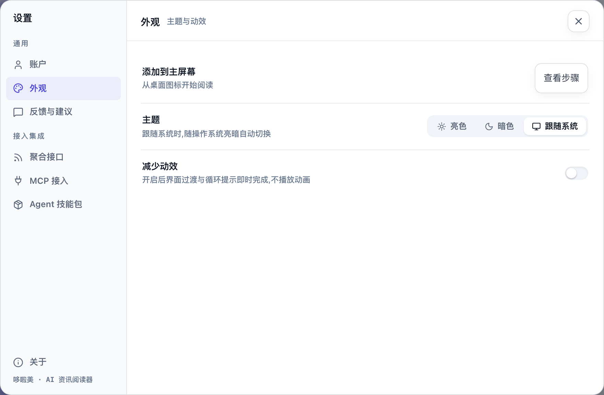
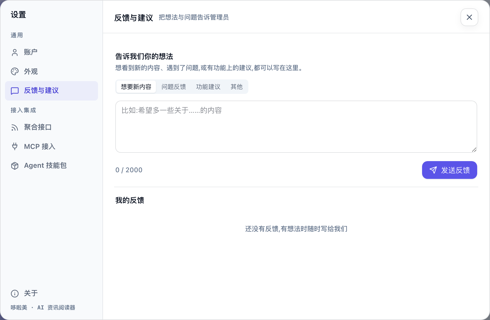

# 常见问题与排错

按遇到问题的场景分组。各功能页末尾也有对应的常见问题，这里汇总最常用的，并补充账户、外观、反馈这类不属于某个功能的问题。

## 登录和账户

### 登录时提示「账号或密码错误」？

检查账号和密码有没有输错，注意大小写。哆啦美不提供自助注册和找回密码，忘记密码请联系给你发放账号的人重置。

### 用着用着提示「登录已过期，请重新登录。」？

重新登录即可。在别的设备上改过密码，或者账号状态有变化时，已登录的页面也需要重新登录。

### 怎么修改密码？

1. 点左侧竖栏底部的「设置」，在「账户」里找到「修改密码」。
2. 依次填「当前密码」「新密码(至少 6 位)」「确认新密码」，点「更新密码」。

改完后当前页面保持登录，其他设备上的登录会失效，需要用新密码重新登录。提示「当前密码错误」说明第一栏填错了；提示「两次输入的新密码不一致」说明后两栏不一样。

在「账户」里还可以「更换头像」。

### 怎么退出登录？

点左侧竖栏最底部的头像，按钮变红并提示「再次点击以退出登录」，再点一次就退出。这样设计是为了防止误点。手机上在「我的」页点「退出登录」，确认即可。

## 早报

### 早报是空的，或者提示「降级生成」？

「降级生成」表示当天够分的内容不多，早报用你订阅来源的最新内容补齐。多订阅一些来源、设置几个兴趣，早报会更充实。完全空白时，先看看是不是一个来源都没订阅。详见[读每天的早报](/features/brief#degraded)。

### 改了兴趣或订阅，早报没变？

改动会在下一次编排时生效。今天的早报顶部会提示「你的兴趣已更新，下次编排生效」，点「立即重编」马上生效。

## 来源和阅读

### 找不到想看的来源？

在「发现」页的搜索框里搜名字或关键词。站内没有的，如果「源」页签上有「添加源」按钮，而这个网站提供 RSS 地址，可以自己加一个，见[找到更多来源](/features/discover#添加自己的-rss-源)。

### 来源旁边显示「暂不可用」？

这个来源暂时不可用，内容暂停显示。订阅会保留，恢复后内容自动回来；不想等也可以直接退订。

### 打开文章图片显示不出来？

部分来源的图片有访问限制，偶尔会加载失败。点文章底部的原文链接可以在原网站上看。

## AI 功能

### 看不到「译为中文」或「问哆啦美」？

翻译、问答和现场生成速读需要站点和你的账号都开通了 AI 服务，没开通时这些入口不会出现；已经生成好的速读和新闻价值分照常显示。「问哆啦美」目前只在电脑上提供。详见[问哆啦美与翻译](/features/ask-and-translate)。

### 提示「今日 AI 使用次数已达上限，请明日再试」？

每个账号每天使用 AI 功能的次数有上限，第二天自动恢复。

## 分享

### 别人打开我分享的公开链接，显示「链接已失效」？

链接可能过期了，或者你已经撤销或换了新链接。在文章的分享菜单里重新生成一个发给对方。如果分享菜单的「公开链接」一栏显示已关闭，说明当前站点暂时不提供公开链接，可以改发站内链接给有账号的同事。

## 手机和主屏幕

### 从主屏幕图标打开要重新登录？

第一次从图标打开时可能需要再登录一次，之后和在浏览器里一样保持登录。更多见[在手机上用](/features/mobile)。

## 外观

### 怎么切换深色模式？

点左侧竖栏底部的「设置」，在「外观」里选「亮色」「暗色」或「跟随系统」。手机上在「我的」页直接切换「亮 / 暗 / 跟随」。

### 页面动画让我不舒服？

在「外观」里打开「减少动效」，界面的动画会减到最少。这个设置只影响当前这台设备和浏览器。

## 反馈和公告

### 想提建议或报问题？

点左侧竖栏底部的「反馈」（或「设置 → 反馈与建议」，手机上在「我的」页）：

1. 选一个类别：「想要新内容」「问题反馈」「功能建议」或「其他」。
2. 写下内容，最多 2000 字，点「发送反馈」。

提交后可以在下方看到处理状态：「待处理」「处理中」「已完成」「已关闭」。收到回复时，「反馈」按钮上会出现一个小圆点，回复显示在你那条反馈下面。还在「待处理」的反馈可以「撤回」。每天最多提交 10 条。

### 页面顶部浮出一条消息？

这是站点发布的公告，几秒后会自动隐藏，下次打开还会出现。点右侧的 ✕ 关闭后就不会再显示。
