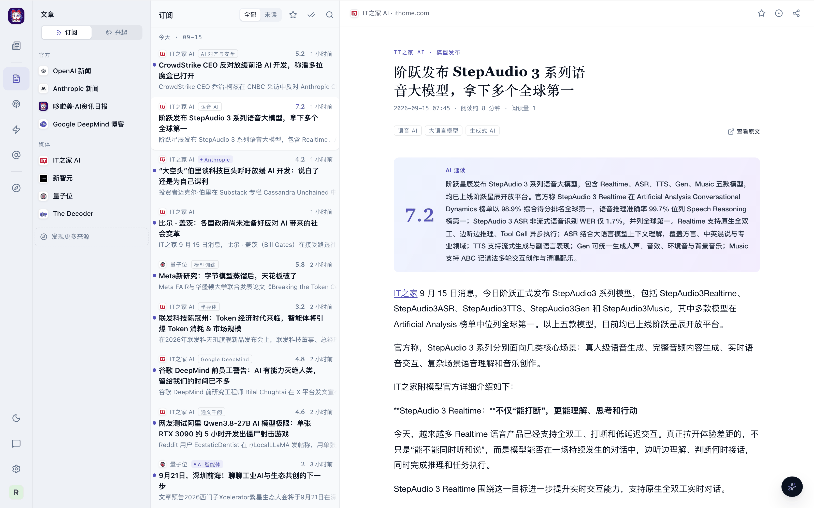
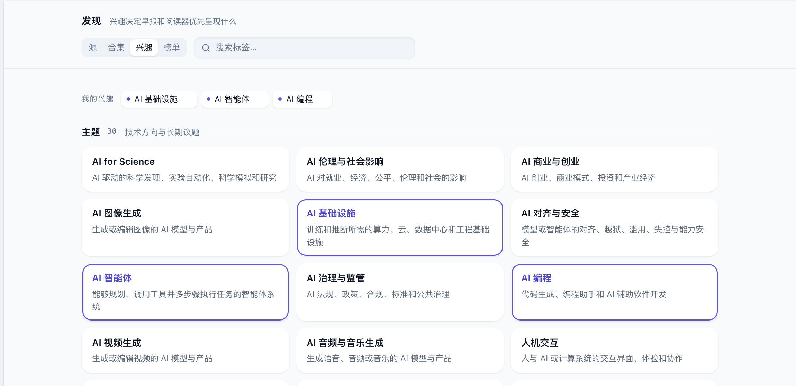
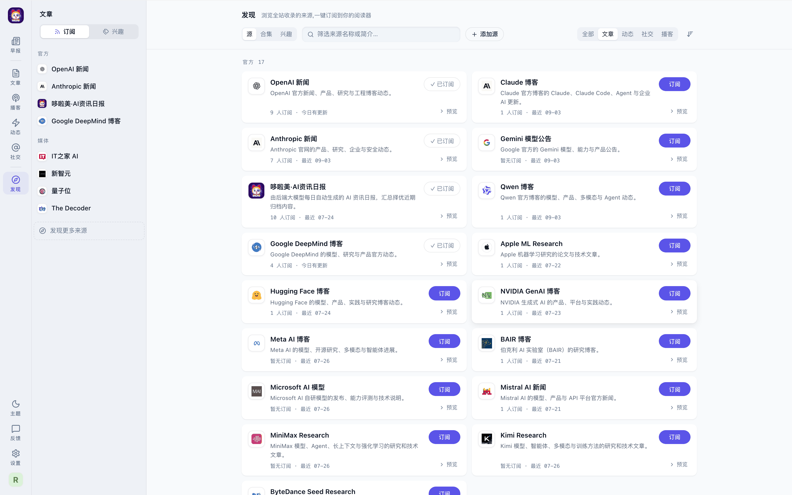
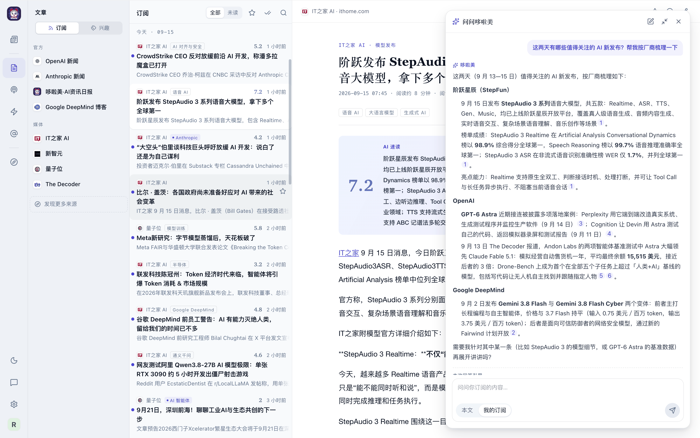
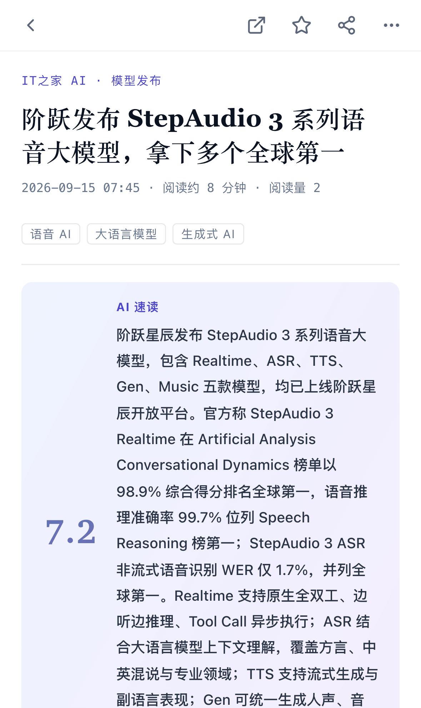
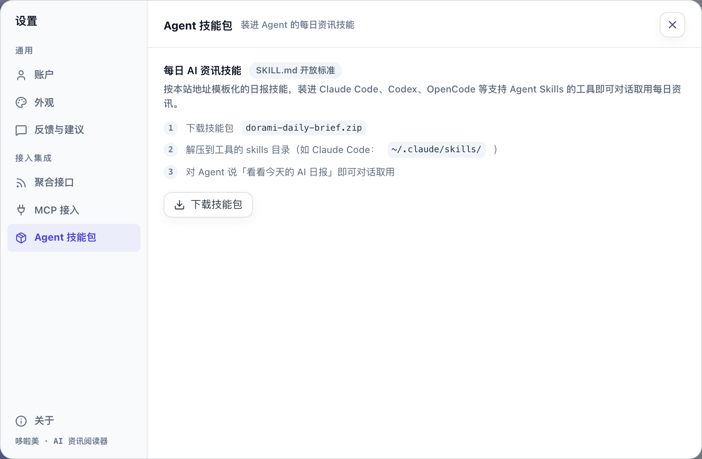

<FeatureRow title="每天一版属于你的早报" link="/features/brief" crop="0.259,0.57,0.664,0.34">

按板块排好的一版报纸，重要的消息占大版面，每张卡片写明它为什么入选：因为你关注的兴趣、因为新闻价值高，还是当天的重大事件。

读完这一版，就知道今天 AI 圈发生了什么。

<template #media></template>
</FeatureRow>

<FeatureRow title="一个阅读器读完所有来源" link="/features/reader" reverse crop="0.469,0.078,0.474,0.46">

订阅的来源都在左栏，文章、播客、动态、社交帖子各有各的页面。分析过的文章开头有 AI 速读，几秒钟判断值不值得读全文。

未读、收藏、搜索、分享都在手边，状态在电脑和手机之间同步。

<template #media></template>
</FeatureRow>

<FeatureRow title="告诉哆啦美你关心什么" link="/features/interests" crop="0,0,0.62,0.72" :ratio="2.054">

从主题、行业、公司和产品里选几个你关注的方向。早报会优先挑命中兴趣的内容，哪怕它来自你没订阅的来源。

在阅读器里也可以按兴趣浏览，只看某个方向的文章。

<template #media></template>
</FeatureRow>

<FeatureRow title="找到更多值得订阅的来源" link="/features/discover" reverse crop="0.293,0.008,0.59,0.46">

站点收录的全部来源都在「发现」页，可以先预览再订阅，也可以按主题合集整组订阅。站点开放了「添加源」时，还能贴一个 RSS 地址自己加。

「榜单」告诉你全站这一周都在聊什么。

<template #media></template>
</FeatureRow>

<FeatureRow title="有问题，问哆啦美" link="/features/ask-and-translate" crop="0.637,0.023,0.35,0.62" :ratio="1.6">

就当前这篇文章或你的全部订阅提问，回答里的 [1] [2] 点一下就打开对应的文章，方便核实。

外文文章一键译成中文，和原文随时切换。

<template #media></template>
</FeatureRow>

<FeatureRow title="听播客，也听中文导读" link="/features/podcasts" reverse>

订阅的 AI 播客在「播客」里直接收听，播放位置自动记住。长访谈有 AI 整理的中文「精品导读」，几分钟听完要点。

<template #media></template>
</FeatureRow>

<FeatureRow title="手机上随时看" link="/features/mobile" crop="0,0,1,0.62" :ratio="0.5955" narrow>

同一个网址用手机浏览器打开就是手机版，不用装 App。添加到主屏幕后，从桌面图标一点就开。

<template #media></template>
</FeatureRow>

<FeatureRow title="把订阅接到你的工具里" link="/features/integrations" reverse crop="0.215,0,0.785,0.5" :ratio="1.528">

用一个令牌把你订阅的内容接到 RSS 工具、脚本，或 Claude Code、Cursor 这类 AI 助手里，让它们也读你关心的资讯。

<template #media></template>
</FeatureRow>

  <a class="home-start-card" href="./guide/quick-start"><strong>快速开始</strong>五分钟：登录、订阅、选兴趣，读第一份早报</a>
  <a class="home-start-card" href="./help/faq"><strong>常见问题</strong>登录、早报、AI 功能、手机上遇到问题先看这里</a>
  <a class="home-start-card" href="./about/philosophy"><strong>设计理念</strong>为什么要订阅、为什么打分、为什么每天只有十来篇</a>

