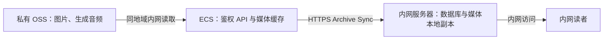

# OSS 媒体存储与 Archive Sync（Issue #92）

状态：开发中，尚未部署。本文区分目标行为与尚未完成的运维能力，不是生产切换完成记录。

## 目标与传输路径

图片与生成音频的持久文件放入与生产 ECS 同地域的私有 OSS 桶，使用标准存储。
业务记录继续由 ECS 本地 SQLite 管理。内网接收节点沿用本地存储后端。



- 接收节点仍从生产应用的 Archive Sync API 下载；不向接收节点下发 OSS 凭据或预签名下载地址。
- 生产 API 检查可见性与发布状态；本地有可用文件时直接返回，缺少本地文件时从 OSS 拉取并校验后返回。
- 音频播放继续保持鉴权、Range、HEAD、发布与撤回语义；不使用重定向绕开应用层授权。
- 接收节点校验文件大小、内容哈希并写入自身磁盘；后续内网阅读使用接收节点的本地副本。
- 生产配置使用同地域内网 Endpoint。接收节点默认 `local`，无需也不应配置生产桶的写入凭据。
- 元数据按同步协议的游标增量传输；不能承诺“每个文件永远只下载一次”，重试、记录更新及重建同步可能重复传输。

阿里云同地域 OSS 内网读取不收流量费；ECS 到接收节点仍属公网出口，按该 ECS 的带宽计费方式结算。
固定带宽套餐不会按传输 GB 数追加收费，也不会抵扣将来直接从 OSS 公网下载产生的费用。
用户自己的“内网”与阿里云“同地域内网”是两个不同的网络。

参考：[OSS 流量计费](https://help.aliyun.com/zh/oss/traffic-fees)、
[ECS 公网带宽计费](https://help.aliyun.com/zh/ecs/public-bandwidth)。

## 数据分别放在哪里

| 数据 | OSS 的角色 | ECS 磁盘的角色 | 内网服务器 |
|---|---|---|---|
| 已缓存的文章图片 | 保存持久对象，按内容哈希去重 | 上传暂存与可恢复的读取缓存 | 保存同步范围内的图片文件 |
| 最终生成音频 | 保存持久对象，发布状态仍由数据库决定 | 合成/校验工作文件与可恢复的播放缓存 | 保存同步范围内的音频文件 |
| 文章正文、转写、摘要、分析、账户、权限、任务、对象位置索引 | 不直接作为在线数据库存储 | SQLite 与 FTS5，承担查询、事务和更新 | 自己的数据库，仅导入同步契约允许的记录 |
| TTS 回执与付费防重复调用缓存 | 仅随独立备份归档保存，不混入普通媒体对象 | 继续持久保存，不能作为普通缓存随意删除 | 不随媒体同步下发生产回执 |
| 下载、转码与校验临时文件 | 默认不长期保存 | 任务工作目录，按任务生命周期清理 | 按本机任务需要处理 |
| 数据库与必要运行状态的备份 | 可选备份目的地，独立 `backups/` 前缀与权限 | 在线一致性快照、归档暂存与本地保留点 | 同步副本不替代生产完整备份 |
| 程序、配置与凭据 | 不混入媒体目录 | 程序部署在 ECS；凭据通过受保护配置提供 | 使用自身配置和凭据 |

选择依据：图片和最终音频体积大、基本不变，适合对象存储；SQLite、任务状态与回执需要本地文件操作和事务语义。
不将运行中的 SQLite 放在 OSS，也不通过把 OSS 挂载成磁盘来运行数据库。
原始 RSS 音频默认不纳入长期媒体库；现有百炼 ASR 直接使用源 URL，旧 ISI 的 OSS 临时中转不是本次媒体桶的启用前提。

## 上传、缓存与回收的约束

1. 新文件先完成本地校验，再上传 OSS，并核验大小与哈希元数据；成功后才进入可用的业务状态。
2. 对象位置与内容哈希记录在数据库中，不持久化临时签名 URL。下载写临时文件，完整校验后原子替换。
3. 上传与磁盘回收是两个步骤。迁移及恢复演练期间可设置 `cache_enabled = false` 保留本地副本；
   验收通过后启用自动回收。自动回收只处理已登记且完整验证过远端内容的本地副本。
4. 自动回收按文件近期使用情况工作，图片和音频有独立容量目标与最短保留时间。
   读取与回收共享跨进程文件锁：延迟发送的图片和同步响应保持读取租约，音频在租约内打开文件句柄。
   回收跳过正在使用、新写入、未登记或校验失败的文件，不删除唯一副本。
   容量是尽量达到的目标，不能当成磁盘硬上限；正在读取、近期写入或故障中的对象可能暂时超过目标。
5. 缓存回收仅删除可从 OSS 恢复的本地字节，不删除业务记录、发布状态或远端对象。
   业务删除、孤立对象回收另按引用、保留期和备份恢复需求处理，不能混用缓存清理规则。
6. 媒体桶不得设置会自动删除有效图片和音频的生命周期规则；临时 ASR 中转与备份使用独立策略。
7. TTS 回执及其防重复付费缓存沿用既有保护，不能纳入普通图片/播放缓存的回收器。

## 备份、迁移与验收

- 备份需覆盖 SQLite（含对象索引）和必要回执；对象本身不能恢复账户、文章关联、发布状态或付费任务状态。
  数据库使用 SQLite 在线备份或停机一致性快照，不直接复制写入中的数据库文件作为唯一备份。
- 对象保留策略必须覆盖需要恢复的数据库备份，防止旧备份引用的对象已被回收。
- 已实现独立的可选自动备份，默认关闭；媒体存储切换不会自动启用备份。
- 存量迁移需要 dry-run、去重、逐项校验、失败重试和可复核报告；本地副本确认安全后才允许清理。
- 回滚需恢复本地文件与匹配的数据库/回执，不能仅把配置切成 `local`。
- 上线前验收：OSS 上传失败不发布、冷读取失败可重试、图片理解与媒体分享正常、音频 Range/撤回正常、
  Archive Sync 接收节点可在断开云端后阅读已有副本、停机缓存回收与重启后冷读取、迁移恢复校验通过。
- 释放 ECS 空间前核验自动回收与读者并发保护，并保留离线恢复路径。

通过本地验收、检视和发布流程后才能切换生产。自动缓存回收与备份调度的实现完成不等于生产已经启用。

## 配置与最小权限

参见 `config/production.example.ini` 的 `[oss]`。图片和音频分别通过 `media_backend`、
`podcast_backend` 选择 `local` 或 `oss`，默认都为 `local`。`bucket`、`region`、`endpoint`、
`prefix` 标识当前部署；Endpoint 必须为与地域一致的 HTTPS 阿里云地址。
生产使用内网 Endpoint，内网接收节点保持两个后端为 `local`。
完全没有 `[oss]` 时无需新增配置；两个后端均为 `local` 时忽略无关 OSS 参数中的坏值。
显式启用 `oss` 后，缺少必要连接参数或凭据会在启动时明确报错，不会悄悄改成本地存储。

生产推荐 `credential_provider = ecs_role` 和 `ecs_role_name`：在 ECS 绑定专用 RAM 角色，
应用通过固定 IMDSv2 地址取得自动刷新的临时凭据，不经过代理、不降级到普通元数据请求。
Docker 需能访问实例元数据服务；上线前在容器网络中做连通性验证。
静态凭据模式为 `static`，仅从 `DORAMI_OSS_ACCESS_KEY_ID`、`DORAMI_OSS_ACCESS_KEY_SECRET`、
`DORAMI_OSS_SECURITY_TOKEN` 读取，不接受 INI 明文凭据。PM2 从启动环境继承这些变量，变更后需更新进程环境。
所有其他字段亦支持对应 `DORAMI_OSS_<大写字段名>` 覆盖；Compose 已显式透传。

运行角色模板见 [oss-runtime-policy.example.json](./oss-runtime-policy.example.json)：替换桶名和部署前缀，
仅授予两个对象前缀的 `oss:GetObject`（含 HEAD）与 `oss:PutObject`，要求 HTTPS。
角色信任主体为本账号 ECS 服务。运行角色不授予删对象、列桶、改 ACL、改生命周期权限。
上传对象继承私有桶权限；桶必须开启阻止公共访问。维护 GC 使用单独、临时授予 `oss:DeleteObject` 的身份。

对象索引 `object_blobs` 属于节点本地元数据，不进入 Archive Sync。前缀变更不会重写已登记对象位置；
桶或地域不匹配时拒绝读写，需要专门迁移，不能静默把旧索引指向新桶。
`minimum_free_mb` 控制冷读取后的磁盘最低余量，`timeout_seconds` 控制 OSS SDK 超时。
Podcast 总配额按远端索引与本地文件的去重并集计算，清理本地缓存不会重置持久容量配额。
统计新增 `remote_objects`、`remote_bytes`；这反映本地登记量，不是桶账单查询。

### 自动缓存

仅 `oss` 后端的数据类型参与回收，`local` 不访问 OSS，也不会被回收。参数如下：

| 参数 | 默认值 | 含义 |
|---|---:|---|
| `cache_enabled` | `true` | 是否自动回收媒体缓存 |
| `media_cache_max_mb` | `2048` | 图片本地缓存容量目标 |
| `podcast_cache_max_mb` | `4096` | 音频本地缓存容量目标 |
| `cache_interval_seconds` | `300` | 同一类型两次回收之间的最短间隔 |
| `cache_min_age_seconds` | `300` | 文件写入或近期访问后至少保留的秒数 |

容量设为 `0` 表示尽量回收符合条件的副本，仍遵守读取租约与最短保留时间；停止自动回收应设置 `cache_enabled = false`。
维护调度每分钟检查一次，无论当前节点承担采集还是阅读角色；多进程通过节点内文件锁避免重复执行。
每个待回收对象都会完整验证远端字节，云故障时保留本地副本并记录错误。
管理员存储面板显示两类文件的后端、本地/远端用量、缓存状态和最近错误；不会把缓存副本算成新增业务内容。

冷文件需要先完整下载并验证，再返回响应；音频 Range 请求也遵循这一流程，首次播放可能比暖缓存慢。
存量目录未登记对象不由自动回收器处理，TTS 回执与付费音频缓存也不在回收范围内。

### 独立备份

`[backup] enabled = false` 为默认值；启用后可选 `destination = local` 或 `oss`。
备份使用 SQLite 在线快照，并与 TTS 写入共享回执锁，打包必要回执、已付费音频及仅存在本地的媒体。
已登记的 OSS 媒体以对象引用写入清单，归档不会再复制一遍；恢复仍依赖这些远端对象，不能删除保留备份所引用的对象。
备份使用独立前缀和凭据配置；现有媒体角色的 GetObject/PutObject 仅覆盖媒体目录，不能据此声称已经获准写入备份目录。

```bash
python scripts/storage_backup.py status
python scripts/storage_backup.py create
python scripts/storage_backup.py verify --archive /path/to/backup.tar.gz --sha256 KNOWN_SHA256
python scripts/storage_backup.py restore --archive /path/to/backup.tar.gz --sha256 KNOWN_SHA256 \
  --offline --target /path/to/new-empty-restore-directory
```

恢复只写入新的空目录，校验归档与每个文件的 SHA-256，拒绝符号链接和路径穿越，不覆盖运行中的数据目录。
恢复后的标准布局为 `database.sqlite3`、`receipts/`、`media/`、`podcast/`；切换应用前必须映射实际存储路径，
并核对数据库中的 `bailian_speech_tts_receipt_root` 覆盖值。配置、云凭据和生产服务切换不由恢复命令自动修改。
完整操作和权限设置见 [自动备份与离线恢复](storage-backups.md)；本地保留策略只回收备份归档，不删除 OSS 媒体或云端备份。

## 维护命令

脚本默认 dry-run，只读取已迁移数据库与本地文件，不启动应用、不创建 schema、不访问 OSS。
报告为 JSONL，包含对象哈希、大小、引用数和结果，不含原文、凭据或签名 URL。
请先备份并单独完成 Alembic 迁移；真实操作必须先停止所有 API、调度器和 worker，再传 `--apply --offline`。
`--offline` 是操作者对停止所有读写进程的确认，不是脚本自动停机；不能在运行中的服务上使用。

```bash
export DORAMI_CONFIG_FILE=/path/to/config/production.ini

# 默认：盘点与本地内容校验；同内容跨 URL 只列一次。
python scripts/migrate_media_oss.py upload > oss-plan.jsonl

# 停止所有应用进程后，上传、登记、HEAD 校验；重复运行可恢复中断进度。
python scripts/migrate_media_oss.py upload --apply --offline > oss-upload.jsonl

# 逐对象完整读取远端，校验 SHA-256；不能只凭上传成功就删本地副本。
python scripts/migrate_media_oss.py verify --apply --offline > oss-verify.jsonl

# 回收本地缓存到指定目标；按文件修改时间从旧到新，仅回收已完整验证的 OSS 副本。
python scripts/migrate_media_oss.py evict --namespace media --cache-target-mb 2048
python scripts/migrate_media_oss.py evict --namespace media --cache-target-mb 2048 --apply --offline

# 恢复所有当前引用文件到本地；损坏文件另存 .corrupt-* 供诊断。
python scripts/migrate_media_oss.py restore --apply --offline > oss-restore.jsonl

# 回退为local前：纯本地全哈希检查，再离线清理已不再需要的远端位置索引。
python scripts/migrate_media_oss.py check-local > oss-local-check.jsonl
python scripts/migrate_media_oss.py finalize-local --apply --offline > oss-finalize.jsonl

# 默认只报告索引中无业务引用的对象，不删除云端数据。
python scripts/migrate_media_oss.py gc > oss-orphans.jsonl
```

任一失败返回非零退出码；成功对象已登记，修复失败原因后重跑即可。
`evict` 的目标是一次维护完成后的容量，不是持续的运行时硬上限；后续新对象与冷读取会重新占用磁盘。
文件根目录中的未登记文件不会因这个命令被删除。迁移工具不处理 TTS 回执缓存。

GC 真实删除还必须指定 `--prune-before YYYY-MM-DD`：仅删除该日期前创建、当前无业务引用的登记对象。
执行者必须先核对保留的备份不再依赖这些对象，运行角色本身无删除权限。
工具不枚举整个桶；“上传成功但数据库登记前进程终止”的对象可通过重跑上传认领，
若业务和本地源文件都已丢失，需额外按专属前缀清单人工核对，不能用本工具宣称桶内绝无孤立对象。

回退到本地必须保持 OSS 启用并停止所有进程，按 `restore` → `check-local` → `finalize-local` 完成恢复与校验，
然后设置后端为 `local` 再重启。清理索引不会删除云端对象；具体步骤见 [从 OSS 恢复为本地存储](oss-local-fallback.md)。
只关配置不会恢复文件：local 模式遇到历史冷对象会明确报错，不发云请求，也不以回源内容冒充归档。
OSS 迁移允许空对象索引降至直接前一版本；索引非空时拒绝降级。回退到更早版本仍受原有迁移边界约束，
可能需要匹配的升级前数据库备份；升级后新增业务数据须另行处理。

## 验证与检视记录

- 本地后端全量：1940 passed；另 1 项本地端口测试受沙盒禁止监听影响，允许监听后单独重跑通过。
- 新增 OSS 契约测试最终 12 passed：上传故障、去重、冷读取、Range/HEAD、撤回、鉴权同步、
  离线迁移/校验/回收/恢复、GC 保留条件、CLI 只读行为与 IMDSv2 凭据刷新。
- 初次实现的前端 lint、14 项测试和 build 通过；补充的存储管理面板与缓存/备份能力需要本轮回归验证。
- `verify_podcast_all_all_e2e.py` 通过：两个隔离的真实 HTTP 节点完成本地后端同步、播放、重启与 checkpoint 幂等；供应商调用为 0。
- OSS 契约测试使用模拟对象服务。2026-09-16 已在生产后端容器验证 ECS 角色的 IMDSv2 临时凭据，
  经同地域 HTTPS 内网 Endpoint 完成独立 80 字节测试对象的 PUT、HEAD、GET 与 SHA-256 校验；
  运行角色仅具有媒体和音频前缀的 GetObject / PutObject 权限。生产应用尚未切换，存量迁移与恢复演练仍待完成。
- PR #109 的实现提交已通过后端与前端 CI；本地协商式检视及用户本地端到端验收仍待完成。
  本记录不替代合入或发布门禁。
- 后续补充测试覆盖默认 local 禁网、错误配置隔离、完整本地回退、空/非空索引迁移、跨进程读取租约、
  回收与 Range/HEAD 并发、取消释放锁、健康状态恢复，以及备份和空目录恢复演练；最终检查结果以本轮 CI 和验收记录为准。
- 2026-09-16 ECS 合成媒体内网测试：2.36 MB PNG 冷读取 2.013 秒、暖读取 0.0005 秒；
  19.2 MB WAV 冷读取 2.725 秒、暖读取 0.0004 秒。4 个并发请求读取同一冷对象的完成时间分别为图片 0.442 秒、音频 2.410 秒。
  这些是独立合成样本的存储路径测量，不是用户端到端延迟保证，也没有据此改变生产应用配置。

### 完善阶段检视与演练（2026-09-16）

- 读取竞态与备份由独立 agent 复核，确认问题均接受并修复；定点复核通过。
  修复包括路由准备与文件发送之间的回收窗口、缓存目录异常隔离、上传失败保留旧恢复点、
  状态临时文件与目录链接安全，以及延迟上传不掩盖真实备份时点。此记录不替代仓库要求的本地协商式检视门禁。
- 备份针对性测试 21 项通过；与运行时状态和实际响应契约联合回归 39 项通过。
- 完整应用隔离演练：模拟对象服务 → 真实 HTTP Archive Sync → 默认 local 接收节点，
  对象服务断开后接收端图片/音频继续正常；生产者冷导出返回可重试 503，服务恢复后返回 200。
- 从实际备份归档解包数据库，恢复清单依赖的两个远端对象，通过 `check-local` 与 `finalize-local`，
  再启动没有 OSS 配置的恢复节点；图片和音频完整 SHA-256 与源数据相同，断开对象服务后仍正常。
- 本地完整应用的管理面板已连接实际状态 API 验证；演示使用隔离合成数据与文件夹对象服务，
  不包含生产内容、不持有生产云凭据、不调用 ASR/TTS。真实 ECS 内网的测量结果见上文。
