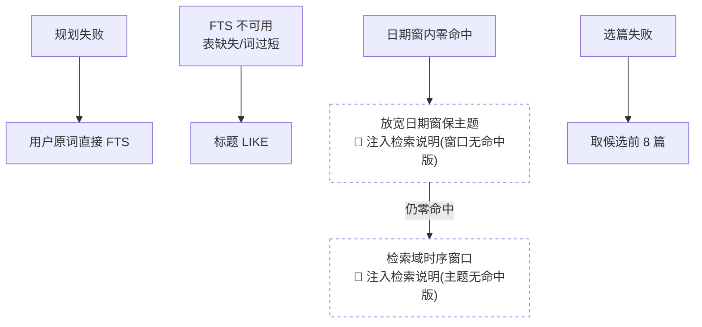

# 检索问答(类 RAG)模块 —— 技术栈与原理报告

> 快照基线:v3.36.0(2026-08-17)。本报告是对现行实现的**说明性快照**,
> 权威事实来源始终是代码本身:`src/services/reader_search.py`(检索编排)、
> `src/storage/fts.py`(FTS5 索引层)、`src/services/reader_ai.py`(上下文组装与引用)。
> 历史决策与重新引入向量的条件见 [rag-retirement-plan.md](./rag-retirement-plan.md)。

## 0. 一句话结论

Dorami **没有向量 RAG**——ChromaDB + embedding 推理栈已于 v3.30–v3.31 退役清仓
(生产从未运行、0 向量化,且生产机 1.6GB 内存跑不动推理栈)。现行方案是
「**LLM 计划检索 + SQLite FTS5**」两段式管线:形态上仍是 RAG
(检索 → 注入上下文 → 生成),但检索基础设施只有 SQLite 自身,零外部服务、零对账。

## 1. 技术栈总览

| 层 | 实现 | 要点 |
|---|---|---|
| 索引 | SQLite FTS5 external-content 虚拟表 + trigram tokenizer(`storage/fts.py`) | 不复制正文,trigger 实时同步,结构性零漂移 |
| 检索编排 | `services/reader_search.py` | 规划 → 召回 → 选篇 → 注入,降级链自持 |
| 上下文/引用 | `services/reader_ai.py` | `build_numbered_context` 编号上下文,`[n]` 即引用锚 |
| LLM | OpenAI 兼容端点(`llm/client.py`) | 规划/选篇走 `aux_model` 辅助轻模型档,作答走主模型 |

整条管线只依赖 engine + LLM,不依赖 FastAPI;检索域(`source_ids`)由调用方解析后
传入(闭包注入形态),可独立单测。

## 2. 全链路架构图

```mermaid
flowchart TD
    Q[读者问题 + 多轮历史] --> PLAN

    subgraph 阶段一 · 查询规划(1 次轻模型 LLM, JSON mode)
        PLAN[plan_query<br/>中英关键词改写 ≤6 · 日期窗折算 · 意图分流]
    end

    PLAN -->|chat 闲聊/元问题| CHAT[不检索,空上下文<br/>纯对话作答]
    PLAN -->|temporal 时效浏览型| WINDOW
    PLAN -->|规划失败| RAW[用户原词直接 FTS]
    PLAN -->|正常检索型| BRIEF{use_brief 且<br/>已订阅日报源?}

    BRIEF -->|是 · 日报即索引| FTS
    BRIEF -->|否| FTS

    subgraph 阶段二 · FTS5 召回(纯 SQL, 无 LLM)
        FTS[fetch_candidates<br/>多关键词 bm25 并集 ∩ 检索域 ∩ 日期窗<br/>bm25 主序 · 日期倒序次序 · 截断 100 篇]
        LIKE[短词(<3 字符)走标题 LIKE 补召回<br/>并入同一候选池,排在 FTS 命中之后]
    end
    RAW --> FTS
    FTS --- LIKE

    FTS -->|日期窗内零命中| RELAX[放宽日期窗保主题<br/>+ 机械注入检索说明]
    RELAX -->|仍零命中| WINDOW[fetch_recent_window<br/>检索域时序窗口兜底<br/>+ 机械注入检索说明]
    FTS -->|有候选| SEL

    subgraph 阶段三 · 选篇(1 次轻模型 LLM)
        SEL[select_articles<br/>标题+来源+日期+160字引子 → 挑 ≤8 篇<br/>候选 ≤8 短路省调用 · 宁缺毋滥可返回空]
    end
    RELAX -->|有候选| SEL
    WINDOW --> SEL

    subgraph 阶段四 · 全文注入
        CTX[build_numbered_context<br/>总预算 14000 字符,单篇预算按篇数摊分<br/>块头带「来源名 · 发布日期」]
        SRC[build_sources_payload<br/>与上下文同源同序,编号 n 即引用锚]
    end
    SEL --> CTX --> SRC

    SRC --> ANS[作答(主模型)<br/>行内 引用标记 → 前端引用 chip 站内跳转]
    CHAT --> ANS
```

两次轻模型调用(规划、选篇)的计费归因并入 `ask` purpose,由调用方传入同一
`usage_meta`;各阶段经 `progress(stage)` 回调上报,驱动前端的阶段化等待态
(plan → search → select → answer)。

## 3. 索引层原理(`storage/fts.py`)

### 3.1 external-content + trigger 同步

```mermaid
flowchart LR
    subgraph articles 主表(SQLModel ORM)
        A[articles<br/>title · content · rowid]
    end
    subgraph FTS5 虚拟表(不在 metadata 中)
        F["articles_fts<br/>content='articles'<br/>tokenize='trigram'"]
    end
    A -- "trigger _ai (INSERT)" --> F
    A -- "trigger _ad (DELETE→撤旧行)" --> F
    A -- "trigger _au (UPDATE=delete旧+insert新)" --> F
    F -.首建时 rebuild 回填存量.-> A
```

- **external-content 模式**:FTS 表不留正文副本,行随 `articles.rowid` 对齐,
  三个同步 trigger 保证与主表实时一致——**结构性零漂移,无需对账巡检**。
  这正是当年推翻向量方案(双状态列 + 04:00 对账)的核心论据。
- **trigram tokenizer**:天然子串匹配、中英文通吃,最平滑地替代旧的标题 LIKE。
  硬约束:短于 3 字符的短语命不中(如两字中文实体名「豆包」),管线里为此专设
  标题 LIKE 补召回分支。
- **建表 DDL 是运行期与迁移的共享单一实现**:`DatabaseStorage.__init__` 与
  Alembic 迁移均调用同一 `ensure_fts`(幂等);`fts_include_object` 让漂移守卫
  只排除 `articles_fts` 前缀对象,真实模型漂移照常捕获。
- **可用性降级契约**:老 SQLite 无 fts5/trigram 时 `ensure_fts` 吞异常返回
  False,搜索降级回标题 LIKE,绝不影响启动。`fts_search_ranked` 返回
  `{rowid: bm25 rank}`(**越小越相关**);`None` = 不可用(回退 LIKE),
  空 dict = 可用但零命中。

### 3.2 召回排序(v3.34 检索质量修复)

此前召回只按发布日期倒序截断,bm25 分数被整个丢弃——宽关键词高命中时,
真正对题但稍旧的文章会被日期序挤出候选池。现行为:

- 多关键词逐 rowid 取**最好(最小)的 bm25 rank**并集;
- 稳定排序两趟:先日期倒序(次序),再 rank 升序(主序);LIKE 命中无 rank,
  以 +inf 落在全部 FTS 命中之后;
- **两阶段取数**:先取轻量列(id/rowid/日期)排序截断到 100 篇,再按序装载
  完整记录——避免为排序把全量正文载入内存。

## 4. 检索编排各阶段(`reader_search.py`)

### 4.1 查询规划(1 次轻模型调用)

把自然语言问题改写成检索计划 JSON:

- `keywords`:中英关键词改写(≤6 个,过滤短于 2 字符);
- `date_gte/date_lte`:日期窗——「最近一周」类相对表达**硬性要求**折算成绝对
  日期(prompt 注入今天日期);
- 意图三分流:`chat`(闲聊/对话元问题 → 不检索纯对话)、`temporal`
  (时效浏览型 → 直接时序窗口,不检索)、`use_brief`(跨期盘点型 → 见下);
- **带最近 4 轮对话历史**(v3.34):「再展开讲讲第二点」类追问只有结合上文
  才能还原成可检索的独立问题,此前每轮只看当前问句必然规划失败。

**「日报即索引」**:跨期盘点型问题(`use_brief`)且检索域含日报源
(`dorami_daily_brief`)时,检索目标收敛为日报正文——每日精选本身就是现成的
压缩层,一篇日报覆盖一天的全量筛选结果。

### 4.2 选篇(1 次轻模型调用)

候选池取前 60 篇,每篇给「标题 | 来源 | 日期 + 正文引子 160 字」,LLM 挑最相关
的 ≤8 篇。三条纪律:

- 候选本身 ≤8 时**短路**省一次调用;
- **宁缺毋滥**(v3.32 三轮返修):具体主题只选真正对题的,「沾边但不对题」
  明令不选——FTS 宽召回是设计内,收紧的是选篇;LLM 判定无一相关时如实返回空,
  作答层基于空资料诚实回答「无法确定」;
- 选篇失败退回候选前 8 篇(精排是增强,不是依赖)。

### 4.3 上下文注入与引用联动

- 总预算 14000 字符;**单篇预算按选中篇数摊分**(下限 2000)——单篇长文问答
  不再只喂开头 2000 字符(v3.34);
- 每块头部带「来源名 | 发布日期」,QA/选篇 prompt 均注入今天日期,系统提示词
  含时效甄别原则(v3.32 四轮返修:此前作答层既无今天日期也看不到各篇发布日期,
  「最近一周」类问题可能把旧闻当新闻);
- **编号 `[n]` 即引用锚**:`build_numbered_context` 与 `build_sources_payload`
  同源同序,作答提示词要求行内 `[n]` 标记且禁止自列清单;前端把 `[n]` 渲染成
  可点引用 chip(站内跳转),末尾出处列表由 sources 载荷确定性渲染(保底必有,
  不靠 LLM)。

## 5. 降级链与机械化诚实层



两条设计原则:

1. **任何一级失败都不 5xx**——规划/选篇是增强,FTS 是主路径但有 LIKE 兜底,
   零命中有时序窗口兜底;
2. **机械化诚实层**:降级一旦**改写了检索语义**(放宽日期窗、或丢掉主题只给
   最新条目),检索层把这个事实以「(检索说明:…)」**确定性注入**上下文头部,
   要求作答先如实说明再作答。实测弱模型不能靠自觉对照日期——会把 7 月旧闻包装成
   「最近一周的新进展」——所以诚实性由代码保证,不交给作答模型。
   措辞随检索域走(`corpus_label`:订阅档=「读者订阅内容」,all 档=
   「哆啦美收录内容」,防 IM 代答渠道把全库语料说成提问者的订阅)。

## 6. 消费方与检索范围

| 消费方 | 范围 | 说明 |
|---|---|---|
| `POST /api/reader/ai/ask` | `subscription` / `all` | 检索圈定型,走本管线;订阅域 = 订阅源并集,all = 全库可见源(隐藏源均排除) |
| 同上 | `article` / `articles` | 显式名单直取正文,**不走检索**(article 是 n=1 特例;articles ≤12 篇,多选问答的预留原语) |
| MCP `search_articles` / `get_rag_context` | 令牌订阅域 | v3.30 同名换芯,出入参兼容(distance 退役) |
| `POST /api/public/subscriptions/{id}/vector/search` | 单订阅 | 路径留存,FTS 芯,与 MCP 同源 |
| IM 机器人代答 | `all` | v3.33.2 拍板由 subscription 改 all |

## 7. 关键参数速查

| 常量 | 值 | 语义 |
|---|---|---|
| `CANDIDATE_LIMIT` | 100 | FTS 召回候选上限(SQL 排序截断) |
| `SELECT_POOL` | 60 | 送入选篇 prompt 的候选池上限 |
| `SELECT_MAX` | 8 | 选篇上限 |
| `_LEAD_CHARS` | 160 | 候选行引子长度 |
| `_CONTEXT_TOTAL` / `_CONTEXT_PER_ARTICLE` | 14000 / 2000(下限) | 注入预算,单篇按篇数摊分 |
| `MIN_TRIGRAM_CHARS` | 3 | trigram 命中硬下限,短词走 LIKE 补召回 |
| `_MAX_FTS_IDS` | 10000 | `rowid IN (...)` 防御上限(SQLite 变量数限制) |

## 8. 向量层的过去与未来

- **退役论证**(v3.30 审视,详见 rag-retirement-plan.md):生产从未运行
  (0 向量化)、生产硬件跑不起推理栈、FTS5 已就绪且结构性零漂移、增长曲线下
  向量形态的运维成本(双状态机/对账/双容器)涨得比收益快。
- **重新引入触发器**(方案 §4,两条件**同时**满足才重启评估):语料 ≫10 万篇,
  **且** ask 用量数据证明模糊语义查询成为真实模式。届时按「派生数据、外部推理、
  可随时全量重建」的轻形态重建,不恢复双状态机/对账架构。
